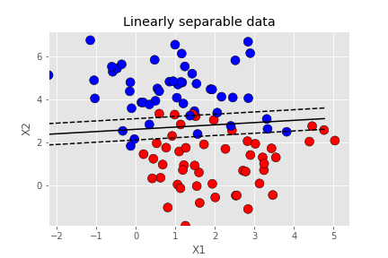
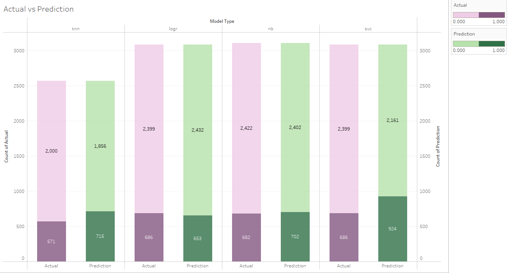
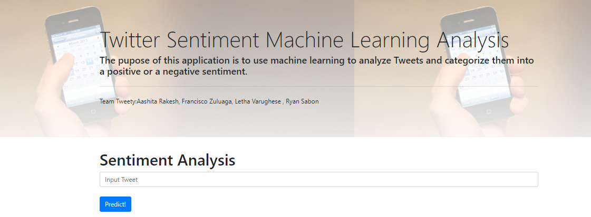
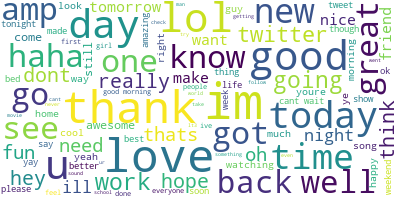
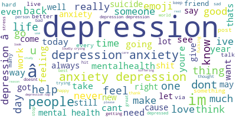

# Twitter_Analysis
This project uses machine learning to create a Twitter sentiment natural language processor.  A Flask app was created for a user to input a tweet and decide if it was a positive or negative tweet.

## Table of Contents
* [General Info](#general-info)
* [Models](#models)
* [Tools Used](#tools)
* [Flask App](#flask-app)
* [Sentiment Output](#sentiment-output)
  * [Positive](#positive)
  * [Negative](#negative)

### General Info
Twitter Data was found on Kaggle, cleaned, and created a pipeline to train and predict several models using Scikit Learn and Pyspark.

The data is cleaned, tokenized, stop words are removed, CoutVectorizer is used to discover the term frequency, and then the word input is hashed.

### Models
* `Naive Bayes`
* `K Nearest Neighbor`
* `Deep Learning`
* `Logistic Regression` 
* `Decision Trees`
* `Support Vector Machine`

### Tools
* `Pyspark`
* `Python`
* `Jupyter Notebook`
* `Pandas`
* `scikit-learn`
* `Tableau`
* `HTML`, `CSS`, and `JavaScript`
* `Bootstrap`
* `Flask`

### Flask App
A website was created to create an analysis on a user-made tweet.  Symbols, punctuation, user-names, and spaces are removed and then we utilize our NLP Pipeline.

### Sentiment Output
The most common words and phrases used in a positive or negative tweet.

#### Positive

#### Negative

